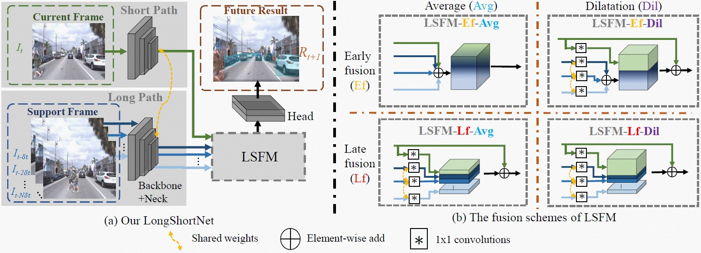

# LongShortNet

## LongShortNet: Exploring Temporal and Semantic Features Fusion in Streaming Perception
<p align='left'>
  
</p>

<br>**[[Paper](https://arxiv.org/abs/2210.15518)]** <br />


## Benchmark

|Model |size |velocity | sAP<br>0.5:0.95 | sAP50 |sAP75| weights |
| ------        |:---: | :---:       |:---:     |:---:  | :---: | :----: |
|[LongShortNet-S](./cfgs/longshortnet/s_s50_onex_dfp_tal_flip_s_1_d_1_l_3_d_1_yolox_shortcut_ep8.py)    |600×960  |1x      |29.8     |50.4 | 29.5 |[link](https://drive.google.com/file/d/13ESdjetcccOKnU0fg54b6czuxBH76C_7/view?usp=share_link) |
|[LongShortNet-M](./cfgs/longshortnet/m_s50_onex_dfp_tal_flip_s_1_d_1_l_3_d_1_yolox_shortcut_ep8.py)    |600×960  |1x      |34.1     |54.8 | 34.6 |[link](https://drive.google.com/file/d/1AFzD2bTSTtuCCWBk2AnU1t9uHVGD1cM_/view?usp=share_link) |
|[LongShortNet-L](./cfgs/longshortnet/l_s50_onex_dfp_tal_flip_s_1_d_1_l_3_d_1_yolox_shortcut_ep8.py)    |600×960  |1x  |37.1 |57.8| 37.7 |[link](https://drive.google.com/file/d/15D6VL_QcL1qBYjBmZCAEa0PNp0TM67vg/view?usp=share_link) |
|[LongShortNet-L](./cfgs/longshortnet/l_s50_onex_dfp_tal_flip_s_1_d_1_l_3_d_1_yolox_shortcut_ep8_1200x1920.py)   |1200×1920  |1x      | **42.7** | **65.4** | **45.0** |[link](https://drive.google.com/file/d/1gI5a2Pf1MOnCkxeNIHLnbgesEOZEXER2/view?usp=share_link) |

## Quick Start

### Installation
You can refer to [StreamYOLO](https://github.com/yancie-yjr/StreamYOLO) to install the whole environments.

### Train
We use COCO models offered by [StreamYOLO](https://github.com/yancie-yjr/StreamYOLO) as our pretrained models.
```shell
bash run_train.sh
```

### Evaluation
```shell
bash run_eval.sh
```


## Acknowledgment
Our implementation is mainly based on [StreamYOLO](https://github.com/yancie-yjr/StreamYOLO). We gratefully thank the authors for their wonderful works.


## Citation
Please cite the following paper if this repo helps your research:
```bibtex
@article{LongShortNet,
  author    = {Chenyang Li and
               Zhi{-}Qi Cheng and
               Jun{-}Yan He and
               Pengyu Li and
               Bin Luo and
               Han{-}Yuan Chen and
               Yifeng Geng and
               Jin{-}Peng Lan and
               Xuansong Xie},
  title     = {LongShortNet: Exploring Temporal and Semantic Features Fusion in Streaming
               Perception},
  journal   = {CoRR},
  volume    = {abs/2210.15518},
  year      = {2022},
  url       = {https://doi.org/10.48550/arXiv.2210.15518},
  doi       = {10.48550/arXiv.2210.15518}
}
```

## License
This repo is released under the Apache 2.0 license. Please see the LICENSE file for more information.

